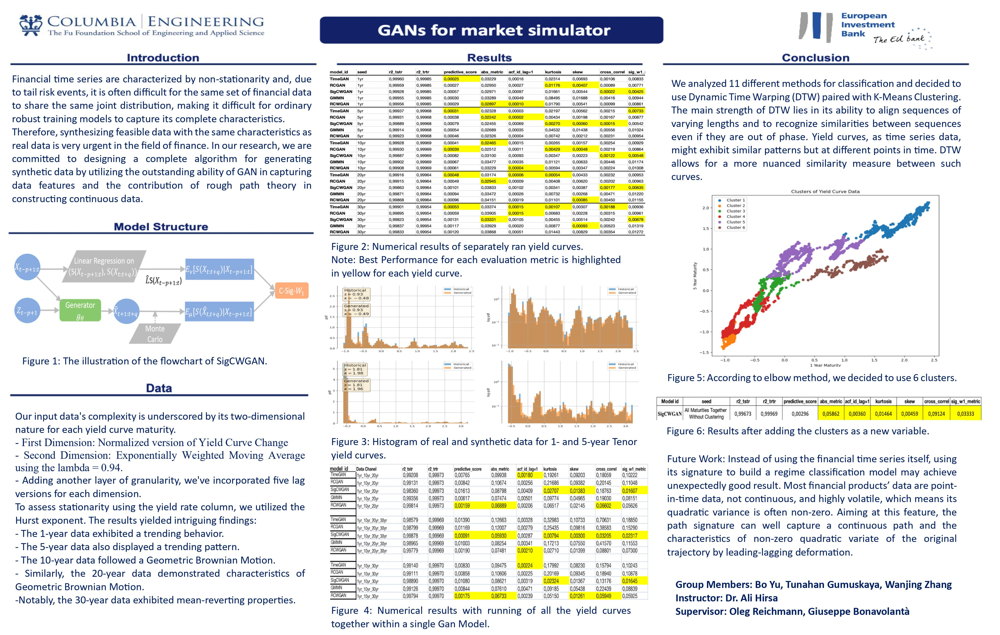

## Research Project for European Investment Bank
This project is a joint project for Columbia Engineering and the European Investment Bank for data analysis purposes.




## Requirements

To setup the conda enviroment:

```setup
conda env create -f requirements.yml
```


We compare SigCGAN with several baselines including: TimeGAN, RCGAN, GMMN(GAN with MMD) with different training methods.


## Training

```train
python train.py -use_cuda -total_steps 1000
```
Optionally drop the flag ```-use_cuda``` to run the experiments on CPU.


## Evaluation

To evaluate models on different metrics and GPU, run:

```eval
python evaluate.py -use_cuda
```
As above, optionally drop the flag ```-use_cuda``` to run the evaluation on CPU.

## Numerical Results

The numerical results will be saved in the 'numerical_results' folder during training process. Running evaluate.py will produce the 'summary.csv' files.
